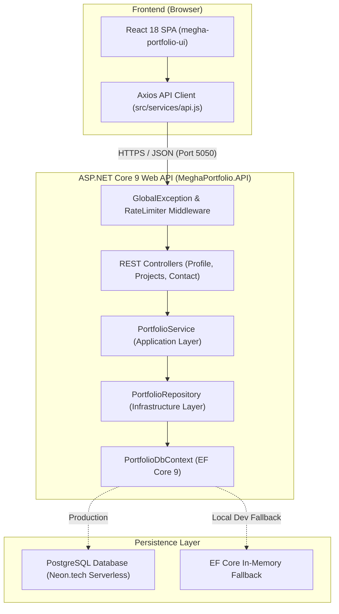

# 05 — System Architecture

## Overview
`MeghaPortfolio` is designed as a **Modular Clean Architecture Monorepo**. The application strictly separates presentation, application logic, domain entities, and database infrastructure.

---

## 1. System Architecture Diagram



---

## 2. Component Explanations

### A. Frontend SPA (`megha-portfolio-ui`)
* **What it is:** A React single-page application built with Vite and ES6+ JavaScript.
* **Why it exists:** Renders a responsive glassmorphism UI for recruiters and interviewers.
* **Communication:** Communicates with backend controllers via Axios HTTP client using JSON payloads.

### B. Middleware Pipeline (`Program.cs`)
* **What it is:** ASP.NET Core HTTP Request Pipeline handlers (`GlobalExceptionMiddleware`, `RateLimiter`, `CorsMiddleware`).
* **Why it exists:** Catches unhandled exceptions, enforces rate limit quotas (5 req/min), and handles CORS preflight checks.

### C. Controllers Layer (`Controllers/`)
* **What it is:** REST Controllers (`ProfileController`, `ExperienceController`, `SkillsController`, `ProjectsController`, `ContactController`).
* **Why it exists:** Maps HTTP routes (`/api/profile`, `/api/projects`, `/api/contact`), validates request payloads, and returns standard HTTP status codes (`200 OK`, `201 Created`, `400 Bad Request`, `429 Too Many Requests`).

### D. Application Service Layer (`Core/Application/Services/`)
* **What it is:** `PortfolioService` implementing `IPortfolioService`.
* **Why it exists:** Orchestrates domain use-cases and handles mapping between EF Core Domain Entities and DTOs.

### E. Infrastructure Repository Layer (`Infrastructure/Persistence/Repositories/`)
* **What it is:** `PortfolioRepository` implementing `IPortfolioRepository`.
* **Why it exists:** Encapsulates database LINQ queries using `.AsNoTracking()` to maximize query performance.

### F. Data Persistence (`PortfolioDbContext`)
* **What it is:** EF Core 9 `DbContext` wrapping PostgreSQL (`Npgsql`) in production and In-Memory provider during local development.

---

## 3. End-to-End Request & Response Data Flow

```text
User Click ➔ React State ➔ Axios GET /api/projects ➔ CORS Check ➔ Global Exception Middleware
                                                                            │
React UI Update ◄─ JSON Array DTO ◄─ Map Entity to DTO ◄─ EF Core .AsNoTracking() ◄─ Repository Query
```
