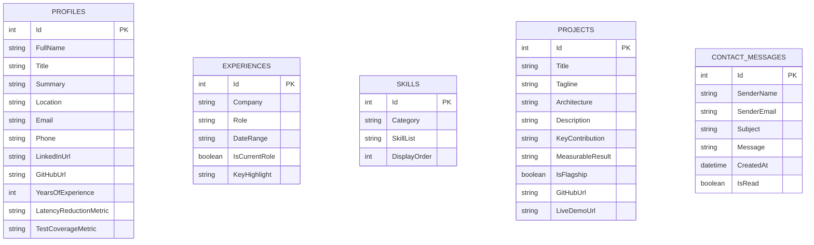

# 10 — Database Documentation

## Overview
`MeghaPortfolio` uses **Entity Framework Core 9** targeting **PostgreSQL** in production, with an **EF Core In-Memory database (`MeghaPortfolioDb`)** fallback during local development.

---

## 1. Entity-Relationship (ER) Diagram

---

## 2. Table Schemas

### A. `Profiles` Table
* `Id` (Primary Key, Integer, Identity)
* `FullName` (nvarchar/text, Not Null)
* `Title` (nvarchar/text, Not Null)
* `Summary` (nvarchar/text, Not Null)
* `Location` (nvarchar/text, Not Null)
* `Email` (nvarchar/text, Not Null)
* `Phone` (nvarchar/text, Not Null)
* `LinkedInUrl` (nvarchar/text, Not Null)
* `GitHubUrl` (nvarchar/text, Not Null)
* `YearsOfExperience` (Integer, Not Null)
* `LatencyReductionMetric` (nvarchar/text, Not Null)
* `TestCoverageMetric` (nvarchar/text, Not Null)

### B. `Projects` Table
* `Id` (Primary Key, Integer, Identity)
* `Title` (nvarchar/text, Not Null)
* `Tagline` (nvarchar/text, Not Null)
* `Architecture` (nvarchar/text, Not Null)
* `Description` (nvarchar/text, Not Null)
* `Technologies` (List/Array, Not Null)
* `KeyContribution` (nvarchar/text, Not Null)
* `MeasurableResult` (nvarchar/text, Not Null)
* `IsFlagship` (Boolean, Not Null)
* `GitHubUrl` (nvarchar/text, Nullable)
* `LiveDemoUrl` (nvarchar/text, Nullable)

### C. `ContactMessages` Table
* `Id` (Primary Key, Integer, Identity)
* `SenderName` (nvarchar/text, Not Null)
* `SenderEmail` (nvarchar/text, Not Null)
* `Subject` (nvarchar/text, Not Null)
* `Message` (nvarchar/text, Not Null)
* `CreatedAt` (Timestamp/DateTime, Not Null, Default UTC)
* `IsRead` (Boolean, Not Null, Default false)

---

## 3. Seed Data Strategy (`PortfolioDataSeeder.cs`)
On startup, `PortfolioDataSeeder.SeedData(dbContext)` checks if database tables are populated. If empty, it seeds the database with verified resume facts (Aspire Systems & Virtusa history) and the flagship **SmartStore** project details.
